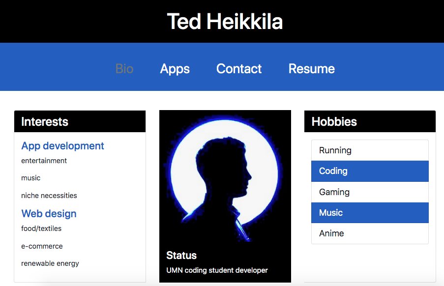
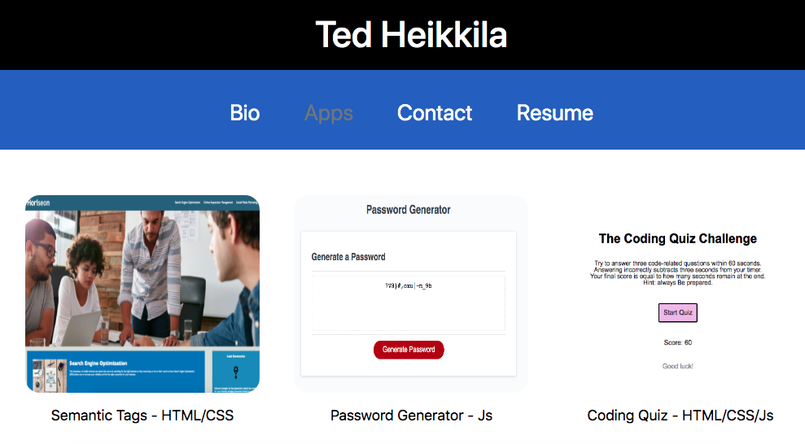
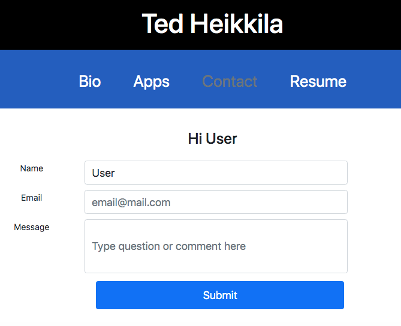
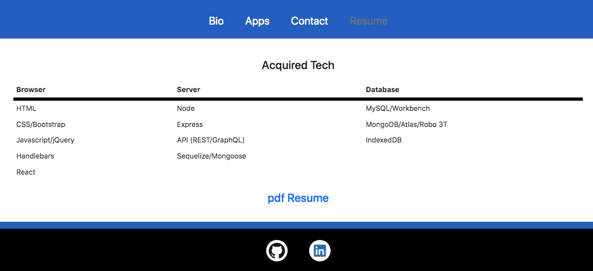

# react-portfolio
uses React to publish portfolio containing bio, apps, contact, resume

  ## Table of Contents

  - [Description](#description)
  - [Technologies](#technologies)
  - [Deployment](#deployment)
  - [License](#license)
  - [Contact](#contact)
  - [Screenshots](#screenshots)

  ## Description

  This is a PC and mobile app designed to function as a professional portfolio using React. Here a potential employer or collaborator can view my bio, apps, and resume to evaluate work and deem suitability within a project or organization. If the fit seems right, they can reach out by completing the contact form. 
  
  ## Technologies:

  * Front-end: React/Jsx, HTML, CSS, Bootstrap, Javascript
  * Back-end: none
  * Dev-deps: Chrome's dev tools

  ## Deployment:

  Check out the portfolio on GitHub here: https://tedheikkila.github.io/react-portfolio/ 

  ## License
  
  
  
  ## Contact

  * If you have any questions/concerns regarding the app, please contact me on GitHub here (see portfolio for email): https://github.com/tedheikkila

## Screenshots

* home/bio

    
  
* apps

    

* contact

    

* resume

    

